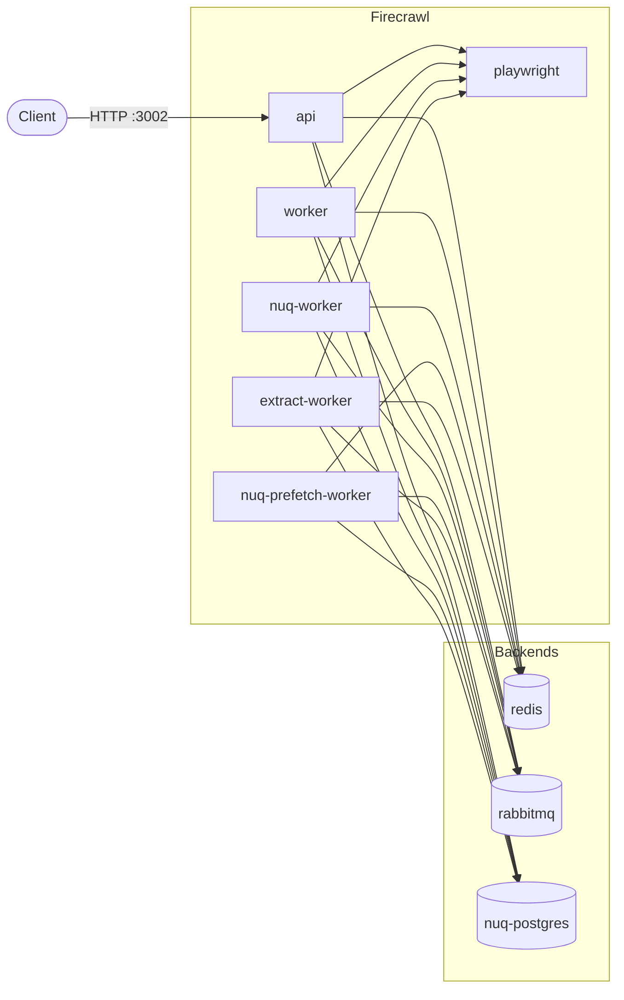

# Firecrawl


[Firecrawl](https://github.com/firecrawl/firecrawl) is an open-source API that
crawls websites and turns them into LLM-ready data — markdown, HTML or
structured JSON. This chart packages the **self-hosted** topology on top of the
[bjw-s common library](https://github.com/bjw-s-labs/helm-charts), using the
official `ghcr.io/firecrawl/*` images.

> Self-hosted Firecrawl has no access to Fire-engine and cannot configure
> Supabase auth. It handles scraping, crawling, mapping and (optionally)
> AI extraction. See the upstream
> [SELF_HOST.md](https://github.com/firecrawl/firecrawl/blob/main/SELF_HOST.md).

## Architecture



| Component             | Role                                            | Service | Default |
| --------------------- | ----------------------------------------------- | :-----: | :-----: |
| `api`                 | HTTP API (`/v1/scrape`, `/v1/crawl`, …) on 3002 |   ✅    |   on    |
| `worker`              | Legacy BullMQ queue worker                      |    —    |   on    |
| `extract-worker`      | AI `/extract` pipeline                          |    —    |   on    |
| `nuq-worker`          | Primary NuQ queue worker                        |    —    |   on    |
| `nuq-prefetch-worker` | NuQ prefetch worker                             |    —    |   on    |
| `playwright`          | Headless-browser renderer                       |   ✅    |   on    |
| `redis`               | Queue + rate-limit store (bundled)              |   ✅    |   on    |
| `rabbitmq`            | NuQ message broker (bundled)                    |   ✅    |   on    |
| `nuq-postgres`        | NuQ queue database (bundled, PVC)               |   ✅    |   on    |

Workers expose health endpoints scraped directly by the kubelet, so they have
no Service of their own.

## Install

```bash
helm repo add obeone https://charts.obeone.cloud
helm repo update
helm install firecrawl obeone/firecrawl
```

Reach the API without an Ingress:

```bash
kubectl port-forward svc/firecrawl-api 3002:3002
curl -X POST http://localhost:3002/v1/scrape \
  -H 'Content-Type: application/json' \
  -d '{"url": "https://firecrawl.dev"}'
```

> Self-hosted instances need **no API key** for the SDKs/HTTP API.

## Configuration

Everything is driven from [`values.yaml`](./values.yaml). Highlights:

### Bundled vs. external backends

Redis, RabbitMQ and NuQ-Postgres are bundled and enabled by default. To use an
external instance, disable the bundled controller **and** point Firecrawl at it:

```yaml
controllers:
  redis:
    enabled: false
firecrawl:
  redis:
    url: "redis://my-redis:6379"
```

The same pattern applies to `firecrawl.rabbitmq.url` / `controllers.rabbitmq`
and `firecrawl.database.url` / `controllers.nuq-postgres`. The external
Postgres **must** use the upstream `nuq-postgres` image (it ships a custom
schema); a vanilla Postgres will not work.

### Credentials & secrets

| Where                                   | Key                          | Default    |
| --------------------------------------- | ---------------------------- | ---------- |
| `secrets.secrets.stringData`            | `BULL_AUTH_KEY`              | `CHANGEME` |
| `secrets.secrets.stringData`            | `OPENAI_API_KEY` (AI mode)   | empty      |
| `rabbitmq.auth.{username,password}`     | bundled broker credentials   | `firecrawl`|
| `nuqPostgres.auth.{username,password}`  | bundled DB credentials       | `postgres` |

Set strong values before exposing the instance. The bundled RabbitMQ uses a
named default user (not `guest`) so workers can reach it over the network. To
manage secrets outside the chart, set `secrets.secrets.enabled: false` and
supply your own Secret referenced via the containers' `envFrom`.

### Optional features

- **AI extraction / JSON mode** — `secrets.secrets.stringData.OPENAI_API_KEY`,
  plus `configMaps.config.data.{OPENAI_BASE_URL,OLLAMA_BASE_URL,MODEL_NAME,MODEL_EMBEDDING_NAME}`.
- **Outbound proxy** — `configMaps.config.data.{PROXY_SERVER,PROXY_USERNAME}` and
  `secrets.secrets.stringData.PROXY_PASSWORD`.
- **`/search` via SearXNG** — `configMaps.config.data.SEARXNG_ENDPOINT`.

### Scaling & resources

Resource defaults are intentionally conservative so a default install fits a
normal node. For real throughput, scale `controllers.nuq-worker.replicas` (keep
`configMaps.config.data.NUQ_WORKER_COUNT` in sync) and raise the `--max-old-space-size`
arg together with the matching memory limit.

## Notes

- **Image pinning** — the API uses the versioned `ghcr.io/firecrawl/firecrawl:2.10.19`.
  Upstream only publishes a floating `latest` for `playwright-service` and
  `nuq-postgres`, so those are pinned **by digest** for reproducibility; bump the
  digest in `values.yaml` when updating.
- **Common library** — pinned to the `4.x` track (`4.6.2`) for broad cluster
  compatibility (Kubernetes ≥ 1.25).

## Maintainers

| Name   | Email               |
| ------ | ------------------- |
| obeone | <obeone@obeone.org> |

---

_Powered by the [bjw-s common library](https://github.com/bjw-s-labs/helm-charts)._
